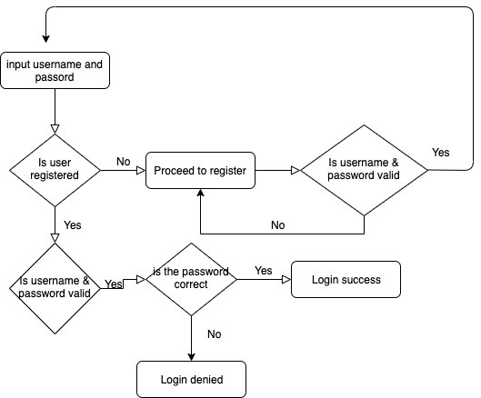

# NetEaseLogin 

## Workflow 流程
1. Login requires a username and a password 
   >输入用户名和密码即可登陆
2. When Login Button is clicked, it will verify the existence of the user. If the user is not registered, it will remind to proceed to register
   >点击登录按钮后，app会检索用户是否存在，如果不存在会引导注册
3. During Login, it will valid username and password. This include checking the format and the correctness of the password
   >用户名的格式和密码会优先被检查，如果没有错误则继续检查密码是否正确
4. During Registration, it will only check the format of the username and password. In addition, the password that entered in the second time should match
   >在注册过程中，用户名和密码对的格式也需要合法，并且两次输入的密码必须相同
5. If a user attempts to login with a incorrect credentials more than 3 times, the account will be frozen for 24 hr
   >如果用户尝试三次以上登陆失败，账户会被锁定24小时以内不能重复登陆
6. When user is logged in, if there is no interaction for at least 30 min, the user will be logged out automatically 
   > 登陆后如果30 分钟内没有活动会被自动退出
7. Same account cannot be logged in twice
   > 相同用户在已经登陆的情况下不能登陆第二次
8. A user has the option to logout manually 
   > 用户可以随时手动退出
9. During the entire login process, it only queries against the database once, the information is cached in LoginManager
   > 整个登陆过程只读取数据库一次，信息储存在 [LoginManager](app/src/main/java/com/xxm/login/LoginManager.java) 里面
   

## Database 数据库
1. It is using a local database which will store all the information in the phone
    >目前使用是本地数据库
2. Considering the future usage may include online authentication, the interface could be re-implemented
    >如需联网检索 可以增加一个class来实现DAO的interface
3. Database schema:

    | USER           |
    |----------------|
    | lastLogin      |
    | lastFailed     |
    | username       |
    | password       |
    | failedAttempts |
   
## Demo 展示
 

2. Live [Demo](https://appetize.io/app/twwrgpywrzf1tw281wyw9t2nz0)

3. Download [APK](app/release/app-release.apk)              

4. Compile source code    

#### Total time Spent 花费时间：1.5 d                                                                                                  